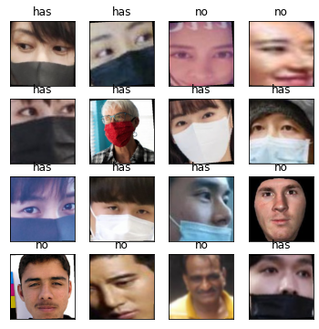
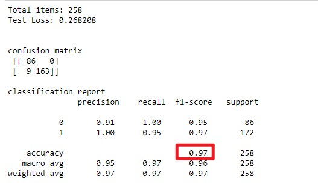

# Mask-Wearing Detection

<h4>The Mask-Wearing Detection a basic Convolutional Neural Network (CNN) is to detect if a person wear a mask. The system is implemented in Pytorch by a high school student. </h4>

---

## Motivation

- Help community to fight against COVID-19. There is an excellent [system](https://github.com/chandrikadeb7/Face-Mask-Detection) that is implemented in Tensorflow. It is possible to modify this project (Torch version) for IoT devices they have mentioned in the repository.
- Help new learners, such as high school students to learn AI in Pytorch.
- Learn AI. I have realized the CNN algorithm can be improved using other AI models. I am interested in testing Graph Neural Network (GNN) for image classifications.

---

## Dataset

The number of train set is 4324. The number of test set is 258. The number of validation set is 61. The dataset is collected from the following sources:

- [Tensorflow-based face mask detection](https://github.com/chandrikadeb7/Face-Mask-Detection)
- [Mask Classifier](https://github.com/Harikrishnan6336/Mask_Classifier/)
- Google search results

---

## Results

- The CNN-based face mask detection is implemented in Pytorch. The overall accuracy is 96.51% with F1-score of 97%. Note our F1-score outperforms the popular [project](https://github.com/chandrikadeb7/Face-Mask-Detection) on Github with F1-score 93%. The Confusion Matrix to evaluated the training and testing results is shown below.

- The training model is available [here](model/model.pt).

---

## Document

The [notebook](wearclassifier.ipynb) is divided into the following sections

- Import libraries
  - numpy, panda, torch, torchvision, sklearn, matplotlib, Image, etc
- Utility functions for saving and loading models
- Show the project folder structure
  - Pytorch provides a default folder structure for easy loading training and testing images
- Data pre-processing ([Part 1](1_intro_image_preprocessing.ipynb) and [Part 2](2_intro_image_normalize.ipynb))
  - The model is able to identify the images correctly irrespective of the size and positioning of an image
  - The transforming functions include transforms.Resize(), transforms.CenterCrop(), transforms.RandomRotation(), transforms.ToTensor(), etc
- Show example images after pre-processing
  - To verify the training or testing images
- CNN model [definition](3_intro_cnn_arthitecture.ipynb)
  - Convolution (conv)
  - Pooling (pool)
  - Fully connected (FC)
- Training
  - The best model (only the best training model for now) is saved
- Testing
  - Load the best model
  - Testing
  - Compute confusion matrix
- Validation
  - validate manually (pick any one image at a time)
  - validate randomly (randomly pick one from validation set at a time)

## Contact

ericxu1728@gmail.com
